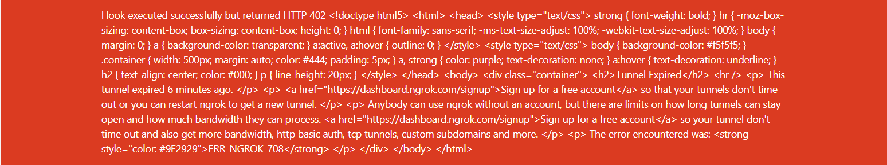

# 산출물

### 1. Docker로 Jenkins 설치

- http://localhost:9090/으로 접속

### 2. Jenkins와 GitLab 연동

- 1. Jenkins에서 GitLab Repository에 접근하기 위해 Access Token을 발행

  - https://lab.ssafy.com/profile/personal_access_tokens에 접속 후 발행
    

- 2. Jenkins에서 플러그인 설치

  - DashBoard > Manager > Jenkins > Plugin Manager

- 3. Jenkins에서 GitLab 연동
  - Dashboard > Manager Jenkins > configure System
    

### 3. Nginx 설치 후 설정

### 4. Pipeline 생성

- 1. GitLab -> Jenkins 트리거 전송을 위해 Jenkins에서 Secret Token 발행
     
     

- 2. GitLab에서 push 이벤트에 대한 trigger 테스트

  - GitLab Repository > Settings > Integrations
  - URL(Jenkins Item URL)/Secret Token/Trigger 설정
    

- 3. Add Webhook 후 push 테스트
  - 

### c.f) 오류

- webhook trigger test error
  - 👉ngrok 사용
- webhook 402 error
  - docker toolbox를 사용할 경우 docker 머신의 ip와 localhost 주소가 다름
  - 👉ngork을 사용하면서 포워딩 할 주소를 localhost가 아닌 docker 머신의 주소로 포워딩( ngrok http [url]:[port])
    
- 파이프라인 credentialsId access denied error
  - 👉 pipeline syntax > snippet generotor > git: Git 선택 > 암호화 된 id를 포함한 pipeline script 생성
  - 👉 를 하면 해결될 줄 알았으나 안됨....😇
