1. [Vue CLI](#vue-cli-프로젝트-기반-devops-개발환경-실습)
2. [Jenkins-docker를 활용한 CI/CD 구축](#jenkins-docker를-활용한-ci/cd-구축)
3. [Github Actions와 Jenkins의 차이점](#github-actions와-jenkins의-차이점)

# Vue CLI 프로젝트 기반 DevOps 개발환경 실습

> :bulb: Vue CLI로 프로젝트를 생성하여 GitHub Pages에 정적 페이지 호스팅 하기 & GitHub Actions로 자동 배포 설정해서 DevOps 개발환경을 구성하는 실습하기

### 1. Github에 vue-devops 프로젝트 생성

### 2. 원격 저장소 설정 및 코드 푸시

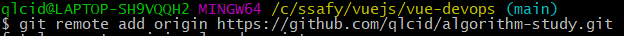
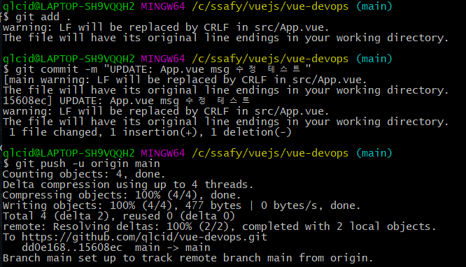

### 3. Github Pages로 배포하기 위한 라이브러리 추가 & pagckage.json에 배포 관련 정보 추가

```json
{
	"name":  "vue-devops",
	"version":  "0.1.0",
	"private":  true,
	"homepage":  "https://qlcid.github.io/vue-devops",
	"scripts":  {
		"serve":  "vue-cli-service serve",
		"build":  "vue-cli-service build",
		"predeploy":  "vue-cli-service build",
		"deploy":  "gh-pages -d dist",
		"clean":  "gh-pages-clean",
		"test:unit":  "vue-cli-service test:unit",
		"lint":  "vue-cli-service lint"
	}
...
```

### 4. 배포용 publicPath 설정

```javascript
// vue.config.js
moduel.exports = {
  publicPath: '/vue-devops/',
  outputDir: 'dist',
};
```

### 5. yarn deploy 명령 실행

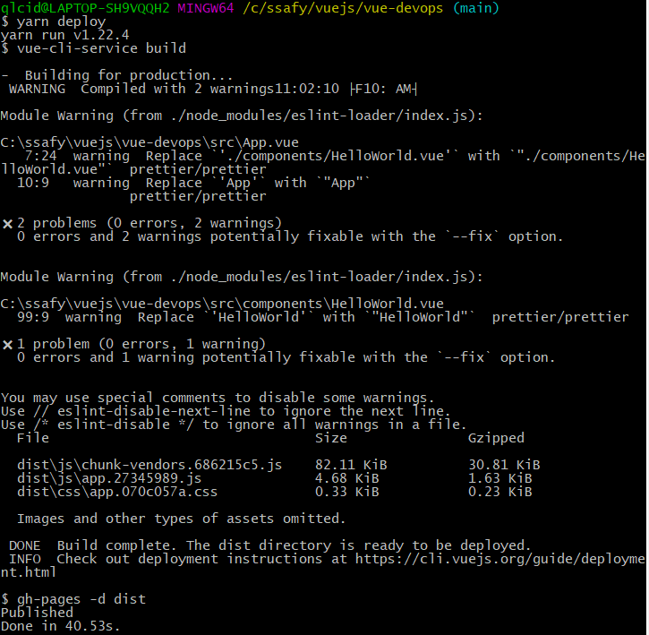

- 원격 저장소에 gh-pages를 생성해 푸시함

## 6. GitHub Actions workflow로 자동 배포

### 6-1. GitHub Actions의 workflow 파일을 작성

```yml
# deploy.yml
name: Deployment

on:
	push:
		branches: [main]
	pull_request:
		branches: [main]

	workflow_dispatch:

jobs:
	deploy:
		runs-on: ubuntu-latest

	steps:
		- name: Checkout source code
		  uses: actions/checkout@master

		- name: Set up Node.js
		  uses: actions/setup-node@master
		  with:
			node-version: 14.x

		- name: Install dependencies
		  run: yarn install

		- name: Build page
		  run: yarn build
		  env:
			NODE_ENV: production

		- name: Deploy to gh-pages
		  uses: peaceiris/actions-gh-pages@v3
		  with:
			github_token: ${{ secrets.GITHUB_TOKEN }}
			publish_dir: ./dist
```

### 6-2. Github Actions Workflow 동작

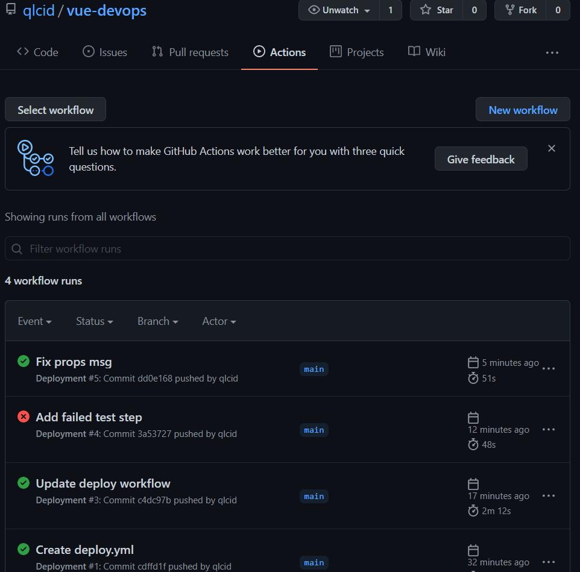

### 6-3. 변경된 내용 commit & push


### 6-4. 배포 완료된 Vue 프로젝트 사이트

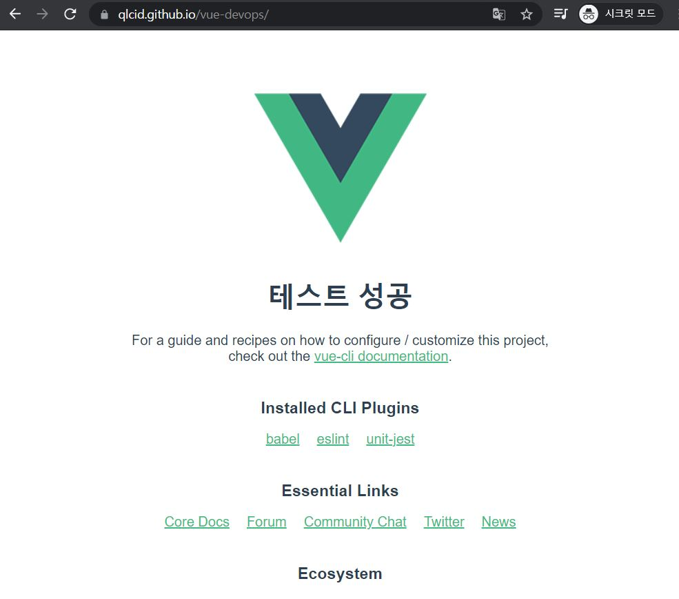

# Jenkins-docker를 활용한 CI/CD 구축

> :bulb: Jenkins-docker를 활용한 CI/CD 구축

# 산출물

### 1. Docker로 Jenkins 설치

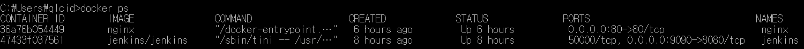

- http://localhost:9090/으로 접속

### 2. Jenkins와 GitLab 연동

- 1. Jenkins에서 GitLab Repository에 접근하기 위해 Access Token을 발행

  - https://lab.ssafy.com/profile/personal_access_tokens에 접속 후 발행
    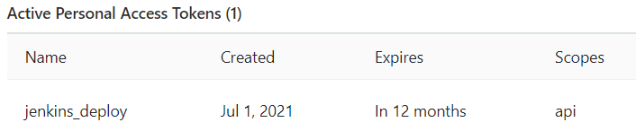

- 2. Jenkins에서 플러그인 설치

  - DashBoard > Manager > Jenkins > Plugin Manager

- 3. Jenkins에서 GitLab 연동
  - Dashboard > Manager Jenkins > configure System
    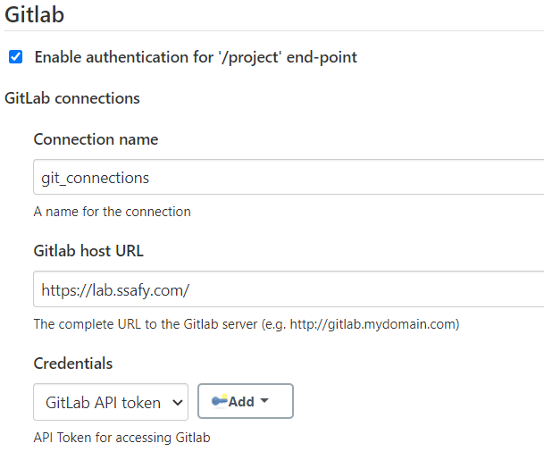

### 3. Nginx 설치 후 설정

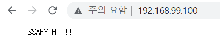

### 4. Pipeline 생성

- 1. GitLab -> Jenkins 트리거 전송을 위해 Jenkins에서 Secret Token 발행
     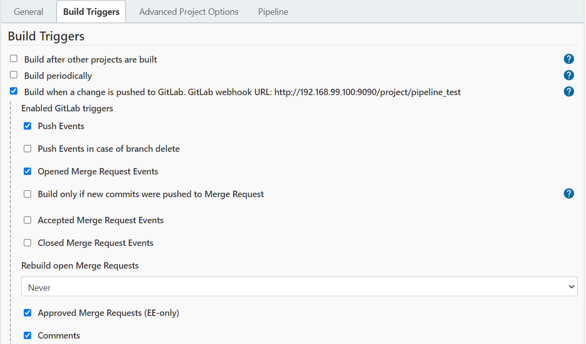
     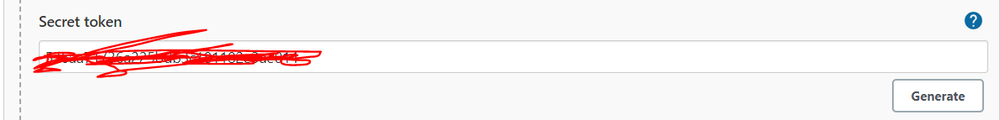

- 2. GitLab에서 push 이벤트에 대한 trigger 테스트

  - GitLab Repository > Settings > Integrations
  - URL(Jenkins Item URL)/Secret Token/Trigger 설정
    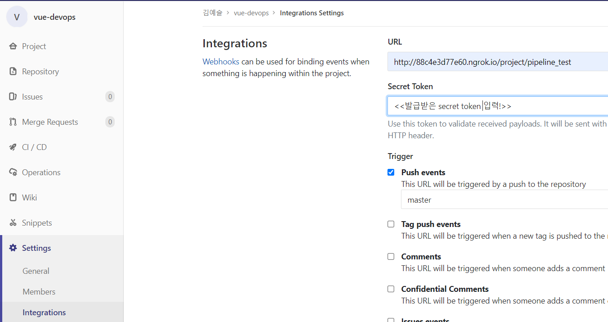

- 3. Add Webhook 후 push 테스트
  - 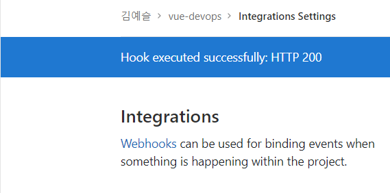

### c.f) 오류

- webhook trigger test error
  - 👉ngrok 사용
- webhook 402 error
  - docker toolbox를 사용할 경우 docker 머신의 ip와 localhost 주소가 다름
  - 👉ngork을 사용하면서 포워딩 할 주소를 localhost가 아닌 docker 머신의 주소로 포워딩( ngrok http [url]:[port])
    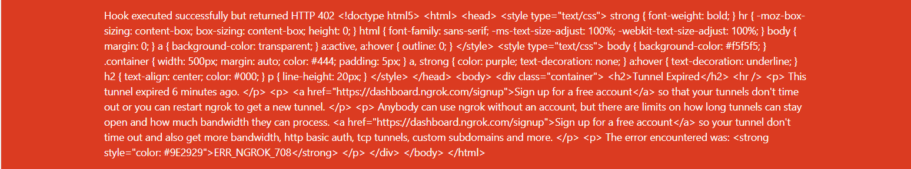
- 파이프라인 credentialsId access denied error
  - 👉 pipeline syntax > snippet generotor > git: Git 선택 > 암호화 된 id를 포함한 pipeline script 생성
  - 👉 를 하면 해결될 줄 알았으나 안됨....😇

# Github Actions와 Jenkins의 차이점

> :bulb: Github Actions와 Jenkins의 차이점을 알아보자!
