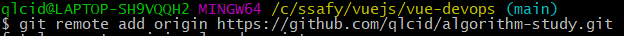
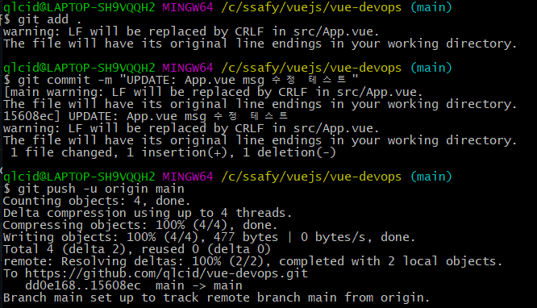
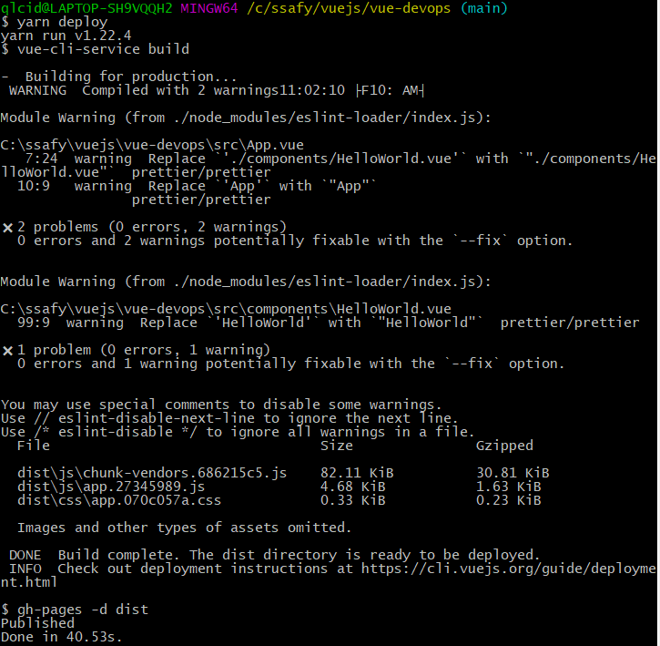
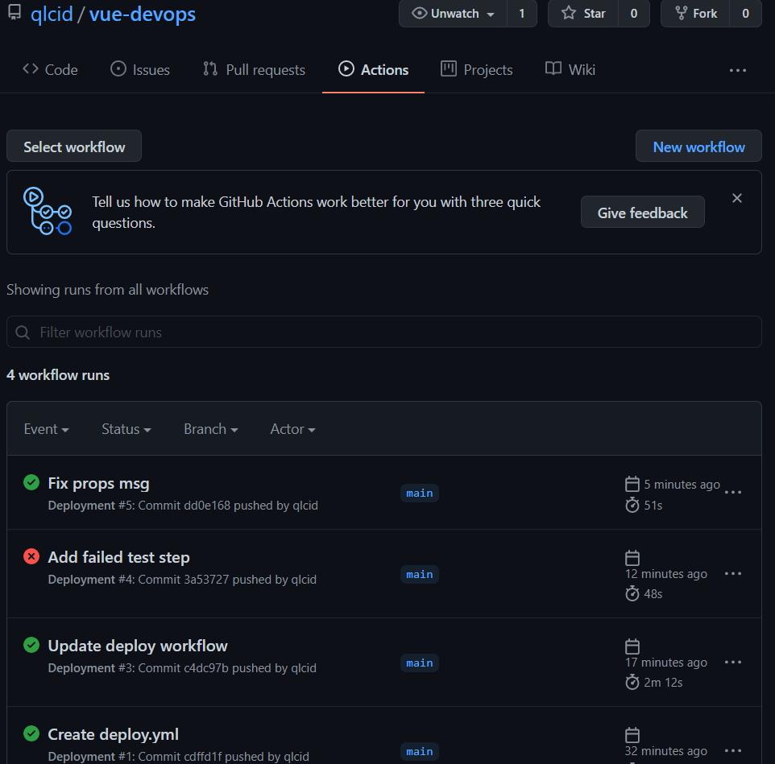
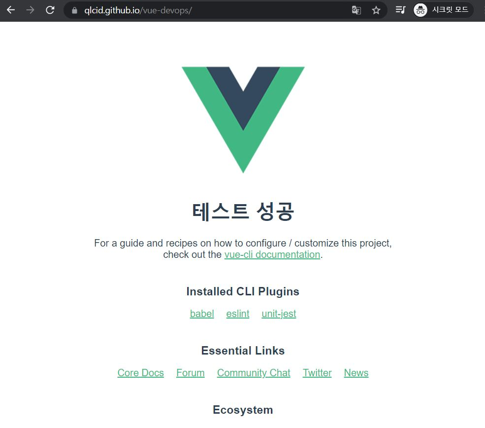

# 산출물

### 1. Github에 vue-devops 프로젝트 생성

### 2. 원격 저장소 설정 및 코드 푸시




### 3. Github Pages로 배포하기 위한 라이브러리 추가 & pagckage.json에 배포 관련 정보 추가

```json
{
	"name":  "vue-devops",
	"version":  "0.1.0",
	"private":  true,
	"homepage":  "https://qlcid.github.io/vue-devops",
	"scripts":  {
		"serve":  "vue-cli-service serve",
		"build":  "vue-cli-service build",
		"predeploy":  "vue-cli-service build",
		"deploy":  "gh-pages -d dist",
		"clean":  "gh-pages-clean",
		"test:unit":  "vue-cli-service test:unit",
		"lint":  "vue-cli-service lint"
	}
...
```

### 4. 배포용 publicPath 설정

```javascript
// vue.config.js
moduel.exports = {
  publicPath: '/vue-devops/',
  outputDir: 'dist',
};
```

### 5. yarn deploy 명령 실행



- 원격 저장소에 gh-pages를 생성해 푸시함

## 6. GitHub Actions workflow로 자동 배포

### 6-1. GitHub Actions의 workflow 파일을 작성

```yml
# deploy.yml
name: Deployment

on:
	push:
		branches: [main]
	pull_request:
		branches: [main]

	workflow_dispatch:

jobs:
	deploy:
		runs-on: ubuntu-latest

	steps:
		- name: Checkout source code
		  uses: actions/checkout@master

		- name: Set up Node.js
		  uses: actions/setup-node@master
		  with:
			node-version: 14.x

		- name: Install dependencies
		  run: yarn install

		- name: Build page
		  run: yarn build
		  env:
			NODE_ENV: production

		- name: Deploy to gh-pages
		  uses: peaceiris/actions-gh-pages@v3
		  with:
			github_token: ${{ secrets.GITHUB_TOKEN }}
			publish_dir: ./dist
```

### 6-2. Github Actions Workflow 동작



### 6-3. 변경된 내용 commit & push


### 6-4. 배포 완료된 Vue 프로젝트 사이트


